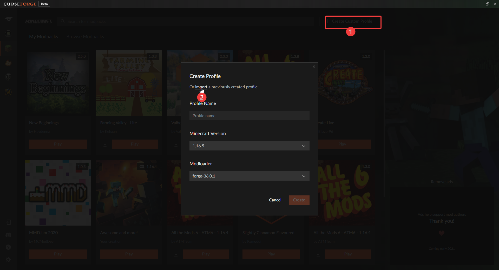

# Für Leonie (alle die zu doof zum lesen sind): klicke da drauf!!! --> [Releases](https://github.com/xwumps/McServerData/releases)

### Inhaltsverzeichnis:
- [Info](#info)
- [Wie komme ich auf den Server?](#wie-komm-ich-auf-den-server)
- [Datei downloads](#datei-downloads)
- [Wie benutze ich die Datei?](#wie-benutze-ich-die-datei)
 
 

### Info
- Das ist die GitHub Page auf der du unsere Server dateien etc. herunterladen kannst!
 

### Wie komm ich auf den Server?
- Lad dir Curseforge herunter, zum download [hier](https://download.overwolf.com/installer/prod/36746b2fd3937f46da7f04b192ca39f4/CurseForge%20Windows%20-%20Installer.exe) klicken!
- Danach lad dir die [Serverdatei](#dateien-downloaden) herunter.
 

### Datei downloads:
- Die Downloads(**MinecraftSMP-v0.0.0.zip**) findest du in den [Releases](https://github.com/xwumps/McServerData/releases) (Bitte immer die neuste Version herunterladen!)

### Wie benutze ich die Datei?
- Führe die Schritte (**1 und 2**) in Curseforge aus! Anschließend öffne die grade heruntergeladene [Datei](#dateien-downloaden).

